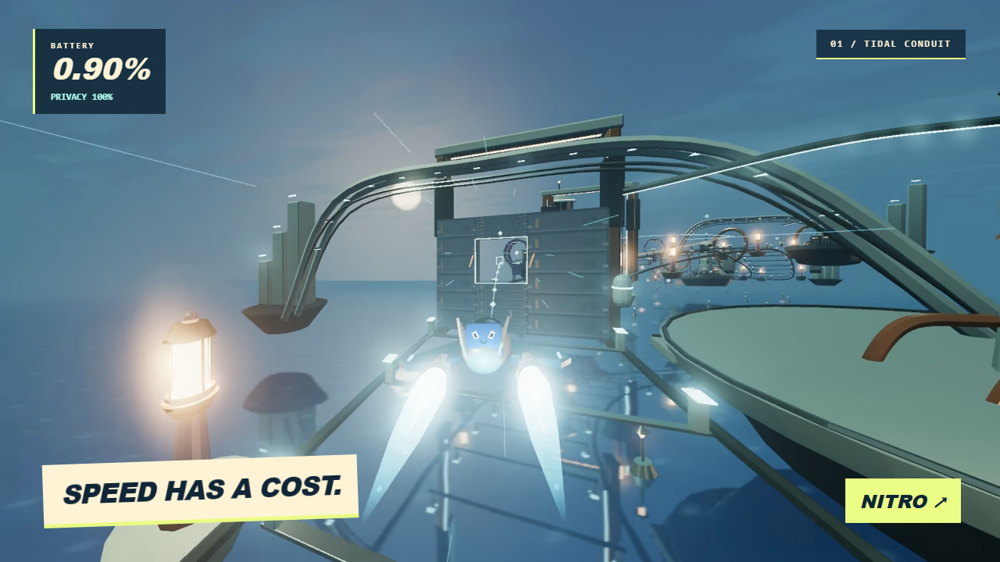
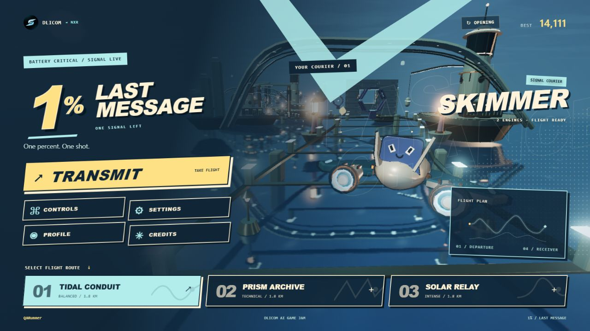
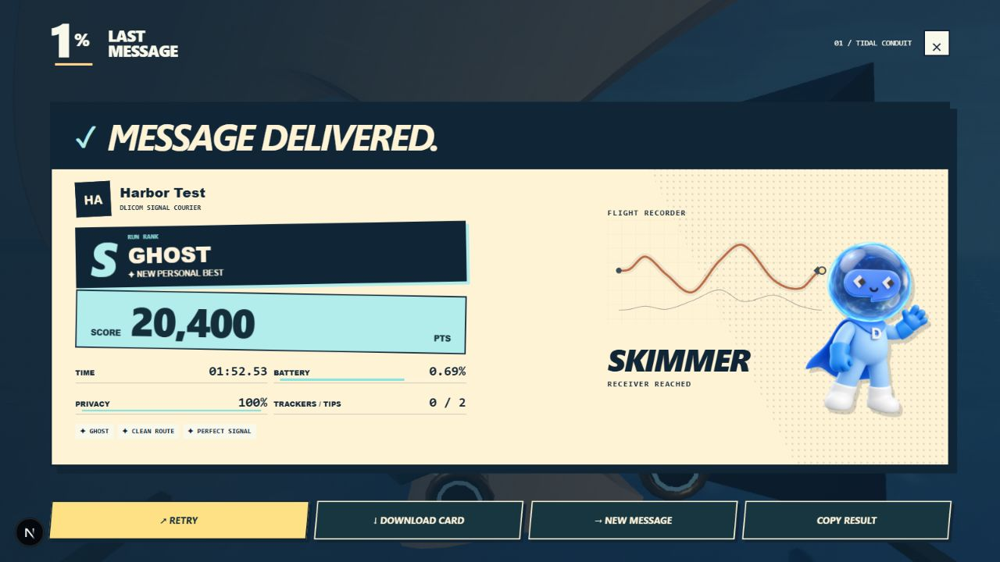

<p align="center">
  
</p>

<p align="center"><strong>One battery percent. One message left.</strong></p>

[](https://github.com/nxrskyaa/OnePercentLastMessage/actions/workflows/verify.yml)

<p align="center">
  <a href="https://last-message-lac.vercel.app/">Play now</a> ·
  <a href="docs/PLAYER_GUIDE.md">Flight guide</a> ·
  <a href="docs/TECHNICAL.md">Development</a> ·
  <a href="docs/LAUNCH.md">Jam submission</a>
</p>



_A frame from the launch film: actual game capture, with an editorial telemetry overlay._

## The last reply

Your phone has 1% battery. You are the encrypted message trying to get through.

Fly a courier through a harbor of relays, moving apertures and tracker fields. Chase the receiver, recover power, and decide how much privacy to spend for speed. A run lasts roughly two to three minutes. When it ends, retry or download a result card with your name and flight stats.

Built by **NXR / [@nxrskyaa](https://x.com/nxrskyaa)** for the **Dlicom AI Game Jam**, with Codex assistance. DILI offers local, contextual guidance. Free to play in a browser; no wallet or account is required.

## Inside the game

- **Three channels:** Tidal Conduit, Prism Archive and Solar Relay change the atmosphere, route variations and obstacle pressure.
- **Three courier silhouettes:** Skimmer, Needle and Comet, each with its own engines and nitro treatment.
- **Four flight sectors:** Departure, Sky Locks, Engine Room and Last Approach, across a curved 1.8 km course.
- **Risk and recovery:** battery, privacy, boosters, trackers, moving gates, rotors, tip chains and clean-pass bonuses.
- **Twelve messages:** a deploy key, a final gm, a reply to Mom and more.
- **Local identity:** name, optional X handle and profile image; English or Indonesian; downloadable PNG results.
- **Original audio:** Afterglow Dispatch, a 116 BPM score, plus synthesized game cues.

## Controls

**The route handles its bends automatically.** Move inside the corridor and aim for **◇**. The cyan 3D line and live key cues show the next approach.

| Input                 | Action                  |
| --------------------- | ----------------------- |
| A / D or Left / Right | Left / right            |
| Q / E                 | Climb / dive            |
| W / Up                | Accelerate              |
| S / Down              | Brake                   |
| Shift                 | Nitro                   |
| Space                 | Scan                    |
| Escape                | Pause / resume          |
| Click-drag the world  | Optional mouse steering |

Touch flight buttons are available on smaller screens. Start with Tidal, collect cyan power nodes, and release the steering keys when the cue says **Hold your line**. More in the [player guide](docs/PLAYER_GUIDE.md).

## Screenshots

| Hangar                             | Flight result                                 |
| ---------------------------------- | --------------------------------------------- |
|  |  |

## Run locally

Node.js 20.9+:

```bash
npm install
npm run dev
```

Open http://localhost:3000. No API keys or backend setup are needed.

```bash
npm run lint
npm run test:course
node tools/check-crafts.mjs
node tools/check-audio.mjs
npm run format:check
npm run build
npm run start
```

See [technical notes](docs/TECHNICAL.md) for architecture, rendering budgets, diagnostics and Vercel deployment. Next.js, TypeScript, React Three Fiber, Three.js, Drei, Zustand and Tailwind power the game.

## Launch film

The [launch release](https://github.com/nxrskyaa/OnePercentLastMessage/releases/tag/v1.0.0-jam) contains the introduction/gameplay MP4, poster and an editable source bundle. Motion graphics are built in [Remotion](launch-video/README.md), using the game's logos, original music and footage recorded from its renderer. Gameplay capture uses scripted controls with normal collision, battery and scoring rules.

## Credits and scope

The world, courier geometry, game mechanics and audio are authored for this project. Dlicom branding is supplied reference material; the mascot illustration is AI-generated from those references, and the procedural mascot is an interpretation. Read [credits and asset provenance](docs/CREDITS.md).

Scores, profiles and settings live in your browser. External profile-image hosts may prevent PNG export; the card then uses initials. Physical-device coverage is limited, so rendering performance depends on your browser and hardware. Quality, mute and reduced-motion options are available in Settings.

For the submission steps, verified official announcements and deadline in WIB, see [launch notes](docs/LAUNCH.md).
